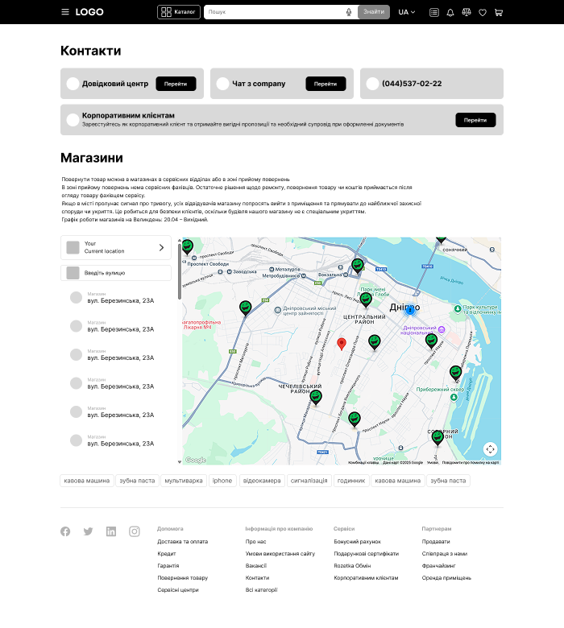
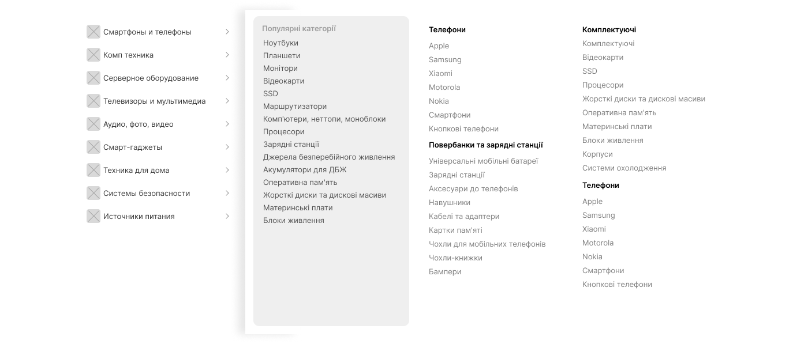
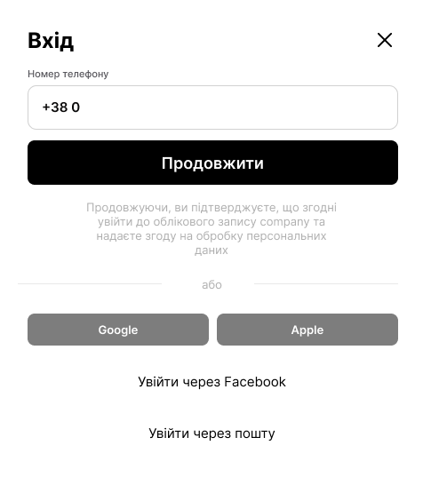

# Оценка страниц и компонентов (Next.js)

## Страницы

### Главная страница
- 
- Динамические данные (баннер, список товаров, категории, рекомендации)
- Получение SEO-метатегов при загрузке
- Использует переиспользуемые компоненты: Header, Footer, Левое сайд-меню, ProductItem, ProductItemList
- Баннер (динамический)
- SEO-метатеги (динамические)
- Главная страница (верстка, интеграция, сборка) _ 20
- Используемые API:
  - /api/getProducts
  - /api/getCatalogCategories — категории каталога для меню
  - /api/getBanner

### Страница категории
- 
- Использует переиспользуемые компоненты: Header, Footer, ProductItem, ProductItemList, BrandList, BreadCrumbs
- BreadCrumbs — навигационная цепочка для отображения пути (категория/сабкатегория)
- Динамический баннер категории
- Список брендов (BrandList) — отдельный компонент, также используется в дефолтном стейте каталога категорий
- Список подкатегорий (CategorySubList) — саб-компонент страницы категории:
  - Картинка, название категории, список сабкатегорий (если есть)
  - При клике происходит редирект на соответствующую страницу
- Списки товаров: "Популярные товары", "Последние просмотренные" — реализуются через ProductItemList
- Описание категории (текстовый блок)
- Теги/популярные поисковые запросы (можно переиспользовать компонент из поиска)
- SEO-метатеги (динамические) _ 19
- Используемые API:
  - /api/getProducts — слайдер популярные и последние товары
  - /api/getMainCategories
  - /api/getTags
  - /api/getPageDescription

### Страница сабкатегории
- 
- Использует переиспользуемые компоненты: Header, Footer, ProductItem, ProductItemList, ProductItemSlider, TagList, BreadCrumbs
- BreadCrumbs — навигационная цепочка для отображения пути (категория/сабкатегория)
- Левое фильтрующее меню (SidebarFilters) — новый компонент: фильтрация по бренду, цене, характеристикам
- Список товаров (ProductItemList)
- Блок "Популярные отзывы в категории" (ReviewList) — подкомпонент страницы:
  - Содержит карточки отзывов: фото товара, имя пользователя, дата, рейтинг (звезды), текст отзыва, ссылка на все отзывы по товару
- Блок "Последние просмотренные" — переиспользуемый компонент ProductItemSlider
- Теги/популярные поисковые запросы — переиспользуемый компонент TagList
- Описание категории (текстовый блок)
- SEO-метатеги (динамические) _ 28
- Используемые API:
  - /api/getProducts — слайдер популярные и конетн
  - /api/getPopularReviews
  - /api/getSubcategoryFilters
  - /api/getTags
  - /api/getPageDescription

### Страница ProductDetails
- 
- Использует переиспользуемые компоненты: Header, Footer, ProductItemSlider, BreadCrumbs, TagList
- Верхнее меню с названиями разделов (описание, характеристики, отзывы и т.д.) — при клике на название раздела страница скроллится к соответствующему блоку
- Слайдер с картинками товаров и миниатюрами поддержка свайпа, миниатюры, зум по клику
- Слайдер с основным изображением товара и миниатюрами
- Поддержка свайпа, миниатюр, зума по клику
- Используется на странице товара и в других местах, где нужен просмотр изображений
- Основная информация о товаре: название, рейтинг, отзывы, цена, наличие, лейблы, кнопки действий (в корзину, избранное, сравнение)
- Характеристики товара (таблица или список)
- Описание товара (текстовый блок)
- Блок отзывов (ReviewList)
- Блок "Похожие товары" (ProductItemSlider)
- Блок "С этим товаром покупают" (ProductItemSlider)
- Слайдер "Вместе дешевле"
- Блок видео
- Блок "Последние просмотренные" (ProductItemSlider)
- SEO-метатеги (динамические) _ 60
- Используемые API:
  - /api/getProducts — слайдер вас могут заинтересовать, с этим товаром покупают
  - /api/getProductDetails
  - /api/getTags

### Страница FAQ
- 
- Использует переиспользуемые компоненты: Header, Footer, BreadCrumbs
- Поиск по вопросам (input + кнопка)
- Блок "Актуальные вопросы" (список ссылок)
- Список категорий FAQ:
  - Сетка карточек категорий (иконка, название, краткое описание)
  - При клике на карточку — редирект на страницу FAQ категории _ 14
- Поиск?

### Страница FAQ категории
- 
- Использует переиспользуемые компоненты: Header, Footer, BreadCrumbs
- Список вопросов (FAQQuestionList):
  - Список вопросов-аккордеонов для FAQ
  - Каждый айтем разворачивается по клику, показывает текст-ответ
  - Используется на страницах FAQ категории и, при необходимости, в других справочных разделах
  - Каждый вопрос — это айтем-аккордеон: при клике разворачивается и показывает спрятанный текст-ответ
- Боковое меню с навигацией по разделам FAQ
- Поиск по вопросам (input + кнопка) + 18

### Страница Контакты
- 
- Использует переиспользуемые компоненты: Header, Footer, TagList
- Кнопки навигации, позвонить в хедере
- Список магазинов (StoreList) — внутренний компонент страницы:
  - Список магазинов с адресами
  - При клике на магазин — карта навигируется к выбранным координатам, зумится, отображаются детали магазина
- Поиск по улице (input + автокомплит)
- Google Map с поддержкой:
  - Мое местоположение (определение и отображение на карте)
  - Выбор местоположения на карте (клик по карте)
  - Маркеры магазинов, отображение информации по клику
- Google API   _26
- Используемые API:
  - /api/getStores
  - /api/searchStores
  - /api/getTags

---

## Переиспользуемые компоненты

### 1. Header (шапка)
- 
- Бургер меню, логотип, каталог, поиск, язык, иконки профиля/корзины/сравнения
- 
- Бургер меню, логотип, поиск, язык, иконки профиля/корзины/сравнения/фейворитс/листов
- Динамические данные (например, количество товаров в корзине)
- SEO-friendly структура
- Использует компонент Menu для бургер-меню (открытие по иконке) + 9
- Функционал поиска:
  - 
  - При клике на инпут поиска открывается дропдаун с популярными запросами
  - 
  - При вводе текста появляется окно с результатами поиска (автокомплит)
  - Поиск по категориям и товарам (группировка результатов)
  - Debounce для запросов к API (оптимизация нагрузки)
  - Not found блок при отсутствии результатов
  - Возможность выбора результата или категории кликом (навигация на соответствующую страницу)
  - Поддержка динамических данных для популярных запросов и результатов поиска (API)
  - Голосовой ввод текста
  - Адаптивность + 18
- Функционал каталога:
  - 
  - При клике на кнопку "Каталог" в хедере открывается выпадающее меню каталога (дефолтный стейт)
  - 
  - Категории и подкатегории отображаются в виде многоуровневого меню
  - В desktop-версии при ховере на категорию в левой части — правая часть обновляется в соответствии с выбранной категорией
  - В мобильной версии правая часть обновляется при клике на категорию
  - При клике на айтем происходит навигация на страницу категории или товара
  - Поддержка динамических данных (API для категорий/подкатегорий)
  - Адаптивность _ 24
- Функционал смены языка:
  - 
  - При клике на кнопку выбора языка в хедере появляется выпадающее меню с вариантами языков
  - Переключение языка интерфейса + 10
  - Адаптивность
- Функционал логина:
  - 
  - Логин реализован через компонент Login
- 
  - Бургер-меню реализован через компонент Menu
  - Открывается в окне поверх страницы, располагается слева, остальной фон затемняется (rgba(0, 0, 0, 0.6))
- Используемые API:
  - /api/getCurrentCustomer — получение информации о пользователе (аватар, имя, email, бонусы)
  - /api/getCart — количество товаров и сумма в корзине
  - /api/getMenu — структура основного меню
  - /api/getNotifications — уведомления пользователя
  - /api/getPopularSearch — популярные поисковые запросы для поиска
  - /api/getCatalogCategories — категории каталога для меню
  - /api/search — автокомплит и результаты поиска
  - /api/getMetatags — SEO-метатеги для страницы
  - /api/auth/phone/start, /api/auth/phone/verify, /api/auth/email, /api/auth/social — все сценарии логина

### 2. Footer (подвал)
- 
- Ссылки, соцсети, информация о компании
- Адаптивность _ 10

### 3. Левое сайд-меню
- 
- Список категорий, фильтры (может кастомизироваться) (API: /api/getCatalogCategories) _ 10

### 4. ProductItem (карточка товара)
- 
- Картинка, название, цена, кнопки действий (like, cart)
- Переиспользуемый пропсами компонент
- Функционал:
  - Лейблы (например, "Новинка", "Хит", "Скидка") отображаются вверху картинки; при клике — редирект на соответствующую страницу опционально
  - В одну строку: оценка в виде количества звездочек + количество отзывов, ссылка на отзывы о товаре опционально
  - Текст "Есть в наличии" опционально
  - Возможность отображения старой цены (перечеркнута) + новой цены опционально
  - Тоггл в избранное (favorites):
    - Запрос к API для добавления/удаления из избранного (API: /api/addToFavourites, /api/removeFromFavourites)
    - Перезапрос страницы продуктов после изменения
  - Сравнение товара:
    - Кнопка для добавления товара в глобальный стейт сравнения
    - Навигация на страницу сравнения товаров
  - Навигация на страницу товара при клике на карточку
  - Кнопка добавления товара в корзину (API: /api/addToCart)
  - Иконка корзины меняется в зависимости от того, добавлен ли товар в корзину _ 24

### 5. ProductItemList (список карточек)
- 
- Сетка карточек, пагинация/ленивая загрузка
- Сортировка и переключение вида (плитка/список) _ 5

### 6. ProductItemSlider
- 
- Горизонтальный слайдер товаров (карточки ProductItem)
- Используется для блока "Последние просмотренные" и других похожих секций
- Фильтр по категориям опционально
- Кнопка смотреть еще редирект _ 8

### 7. TagList
- 
- Список тегов/популярных поисковых запросов
- Используется на страницах категорий, сабкатегорий, в поиске _ 4
- (API: /api/getTags)

### 8. BreadCrumbs
- 
- Навигационная цепочка для отображения пути (категория/сабкатегория/товар)
- Используется на страницах категорий, сабкатегорий, товара _ 4
- (API: /api/getBreadcrumbs)

### 9. ProductImageSlider (переиспользуемый компонент)
- 
- Слайдер изображений товара
- Используется на странице товара _ 8

### 10. Menu (переиспользуемый компонент)
- 
- 
- **Гость:**
  - Кнопка "Каталог"
  - Ссылка "Довідковий центр"
  - Блок с предложением войти (текст + кнопка "Увійдіть в особистий кабінет")
  - Ссылки: Корзина, Списки порівнянь, Відстежити посилку, Location, Чат, Магазини
  - Блоки: "Допомога" (Доставка та оплата, Кредит, Гарантія, Повернення товару, Сервісні центри), "Інформація про компанію" (Про нас, Умови використання сайту, Вакансії, Контакти, Всі категорії), "Сервіси", "Партнерам"
  - Кнопки загрузки приложений (Google Play, App Store)
  - Соцсети (Facebook, Twitter, LinkedIn, Instagram)
- **Залогиненный пользователь:**
  - Кнопка "Каталог"
  - Ссылка "Довідковий центр"
  - Блок с профилем (имя, email)
  - Ссылка "Бонусний рахунок"
  - Ссылки: Корзина, Списки порівнянь, Відстежити посилку, Location, Чат, Магазини
  - Блоки: "Допомога", "Інформація про компанію", "Сервіси", "Партнерам"
  - Кнопки загрузки приложений (Google Play, App Store)
  - Соцсети (Facebook, Twitter, LinkedIn, Instagram)
- Все пункты меню кликабельны, реализуют переходы или открытие модальных окон.
- Адаптивность: мобильная и десктопная версия _ 17

### 10. Login
- 
- модальное окно логина c фоном rgba(0, 0, 0, 0.6), окно по центру экрана
  - Ввод номера телефона, кнопка продолжить (API: /api/auth/phone/start)
  - Альтернативные способы входа: Google, Apple, Facebook, почта (API: /api/auth/social, /api/auth/email)
  - После ввода номера и клика на "Продолжить" появляется меню ожидания кода из SMS
    - Ввод кода, повторная отправка, обработка ошибок (API: /api/auth/phone/verify)
  - При клике на "Увійти через пошту" появляется меню входа по email и паролю
    - 
    - Ввод email, пароль, кнопка продолжить
    - Восстановление пароля, переключение на вход по телефону
  - Адаптивность
  - Вход с помощью Apple/Google _ 40

---

## Техническая настройка и интеграции
- Настройка Redux Toolkit (или аналога, например, Zustand) + Persist для Next.js _ 4
- Настройка i18n (next-i18next или аналог) для Next.js _ 8
- Настройка axios (или аналога, например, fetch wrapper) для Next.js _ 4

---

## Примечания
- Компоненты будут использоваться на всех страницах, что ускорит дальнейшую разработку.
- Оценка дана для реализации с динамическими данными и адаптивностью.
- SEO реализуется через next/head и динамические пропсы.
- Время может корректироваться после анализа всех макетов и уточнения требований.
