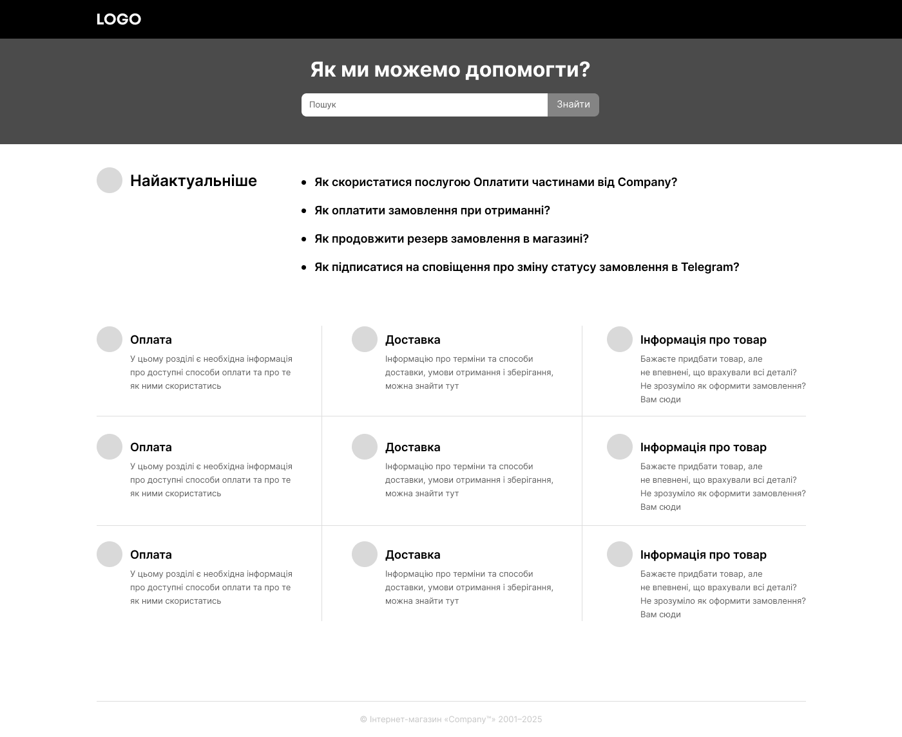
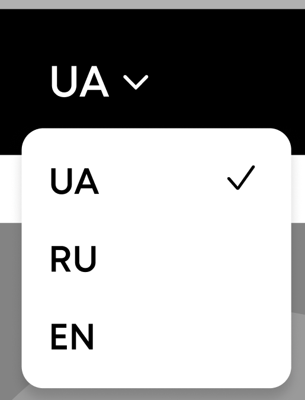

# Оценка страниц и компонентов (Next.js)

## Страницы

### Главная страница
- 
- Динамические данные (баннер, список товаров, категории, рекомендации)
- Получение SEO-метатегов при загрузке
- Использует переиспользуемые компоненты: Header, Footer, Левое сайд-меню, ProductItem, ProductItemList
- Баннер (динамический)
- SEO-метатеги (динамические)
- Главная страница (верстка, интеграция, сборка) _ 20
- Используемые API:
  - /api/getProducts
  - /api/getCatalogCategories — категории каталога для меню
  - /api/getBanner

### Страница категории
- 
- Использует переиспользуемые компоненты: Header, Footer, ProductItem, ProductItemList, BrandList, BreadCrumbs
- BreadCrumbs — навигационная цепочка для отображения пути (категория/сабкатегория)
- Динамический баннер категории
- Список брендов (BrandList) — отдельный компонент, также используется в дефолтном стейте каталога категорий
- Список подкатегорий (CategorySubList) — саб-компонент страницы категории:
  - Картинка, название категории, список сабкатегорий (если есть)
  - При клике происходит редирект на соответствующую страницу
- Списки товаров: "Популярные товары", "Последние просмотренные" — реализуются через ProductItemList
- Описание категории (текстовый блок)
- Теги/популярные поисковые запросы (можно переиспользовать компонент из поиска)
- SEO-метатеги (динамические) _ 19
- Используемые API:
  - /api/getProducts — слайдер популярные и последние товары
  - /api/getMainCategories
  - /api/getTags
  - /api/getPageDescription

### Страница сабкатегории
- 
- Использует переиспользуемые компоненты: Header, Footer, ProductItem, ProductItemList, ProductItemSlider, TagList, BreadCrumbs
- BreadCrumbs — навигационная цепочка для отображения пути (категория/сабкатегория)
- Левое фильтрующее меню (SidebarFilters) — новый компонент: фильтрация по бренду, цене, характеристикам
- Список товаров (ProductItemList)
- Блок "Популярные отзывы в категории" (ReviewList) — подкомпонент страницы:
  - Содержит карточки отзывов: фото товара, имя пользователя, дата, рейтинг (звезды), текст отзыва, ссылка на все отзывы по товару
- Блок "Последние просмотренные" — переиспользуемый компонент ProductItemSlider
- Теги/популярные поисковые запросы — переиспользуемый компонент TagList
- Описание категории (текстовый блок)
- SEO-метатеги (динамические) _ 28
- Используемые API:
  - /api/getProducts — слайдер популярные и конетн
  - /api/getPopularReviews
  - /api/getSubcategoryFilters
  - /api/getTags
  - /api/getPageDescription

### Страница ProductDetails
- 
- Использует переиспользуемые компоненты: Header, Footer, ProductItemSlider, BreadCrumbs, TagList
- Верхнее меню с названиями разделов (описание, характеристики, отзывы и т.д.) — при клике на название раздела страница скроллится к соответствующему блоку
- Слайдер с картинками товаров и миниатюрами поддержка свайпа, миниатюры, зум по клику
- Слайдер с основным изображением товара и миниатюрами
- Поддержка свайпа, миниатюр, зума по клику
- Используется на странице товара и в других местах, где нужен просмотр изображений
- Основная информация о товаре: название, рейтинг, отзывы, цена, наличие, лейблы, кнопки действий (в корзину, избранное, сравнение)
- Характеристики товара (таблица или список)
- Описание товара (текстовый блок)
- Блок отзывов (ReviewList)
- Блок "Похожие товары" (ProductItemSlider)
- Блок "С этим товаром покупают" (ProductItemSlider)
- Слайдер "Вместе дешевле"
- Блок видео
- Блок "Последние просмотренные" (ProductItemSlider)
- SEO-метатеги (динамические) _ 60
- Используемые API:
  - /api/getProducts — слайдер вас могут заинтересовать, с этим товаром покупают
  - /api/getProductDetails
  - /api/getTags

### Страница Корзина
- 
- Использует переиспользуемые компоненты: Header, Footer, ProductItem, ProductItemList
- Внутренние компоненты: CartItem, PromoCodeWidget, OrderSummaryCard, AdditionalServices, CartPolicies
- Функционал:
  - Список товаров с количеством, ценой (старая/новая), удалением; продавец, наличие
  - Промокоды: добавление/удаление, валидации, отображение скидки
  - Блок «Разом/Итого»: промежуточные суммы, доставка, к оплате; кнопка «Оформить заказ»
  - Дополнительные услуги (чекбоксы) с пересчетом итогов
  - Автообновление сумм при изменении количества/услуг; обработка ошибок
  - Сохранение состояния корзины для гостя (localStorage) и синхронизация для юзера
  - Навигация к чекауту, возвращение к покупкам
- SEO-метатеги (динамические) _ 24
- Используемые API:
  - /api/getCart
  - /api/updateCartItem
  - /api/removeFromCart
  - /api/applyPromoCode
  - /api/removePromoCode
  - /api/getAdditionalServices

### Страница Оформление заказа
- 
- Использует переиспользуемые компоненты: Header, Footer, ProductItem, ProductItemList
- Внутренние компоненты: GuestLoginBlock, CheckoutItems, DeliverySelector, PaymentSelector, ReceiverForm, PromoCodeModal, OrderSummaryCard
- Функционал:
  - Опция входа для гостя (телефон/соцсети/email) — доступна только если пользователь не авторизован
  - Промокоды: клик открывает модалку ввода; проверка промокода на бэкенде; отображение скидки/ошибок
  - Доставка: список вариантов и тарифы приходят с бэкенда; выбор отделения/адреса; динамический пересчет сумм
  - Оплата: варианты оплаты приходят с бэкенда; поддержка постоплаты/онлайн; подсказки/ограничения
  - Получатель: форма ФИО/телефон; валидации, автозаполнение из профиля для авторизованных
  - Итого: суммы, доставка, к оплате; кнопка «Подтвердить заказ» с блокировкой повторных кликов
  - Обработка ошибок (недоступность опции, невалидный промокод), сохранение черновика заказа
- SEO-метатеги (динамические) _ 28
- Используемые API:
  - /api/getCart
  - /api/checkout/getDeliveryOptions
  - /api/checkout/getPaymentOptions
  - /api/checkout/applyPromoCode
  - /api/checkout/removePromoCode
  - /api/checkout/createDraft
  - /api/checkout/confirmOrder

### Страница успешного заказа
- Использует переиспользуемые компоненты: Header, Footer, ProductItemSlider, TagList
- Внутренние компоненты: OrderSuccessCard (номер заказа, сумма, способ оплаты/доставки), NextSteps (что дальше), RecommendedBlock
- Функционал:
  - Отображение информации о заказе: номер, дата, сумма, статус, оплата, доставка
  - CTA: перейти к заказам в профиле, распечатать/скачать чек, продолжить покупки
  - Блок «Вас может заинтересовать» (ProductItemSlider), теги
  - Для постоплаты — подсказки по оплате, для самовывоза — адрес/режим работы
- SEO-метатеги (динамические) _ 10
- Используемые API:
  - /api/checkout/getOrderById
  - /api/getProducts — рекомендации

### Страница 404 (Not Found)
- 
- Использует переиспользуемые компоненты: Header, Footer, ProductItemSlider
- Функционал:
  - Сообщение об ошибке и кнопка «На главную»
  - Блок «Последние просмотренные» или рекомендации
  - Трекинг попаданий на 404 для аналитики
- SEO-метатеги (динамические) _ 6
- Используемые API:
  - /api/getLastViewed
  - /api/getProducts — рекомендации

### Страница 500 (Server Error/maintenance)
- 
- Использует переиспользуемые компоненты: Header, Footer, ProductItemSlider
- Функционал:
  - Сообщение о технических работах/ошибке и кнопка «На главную»
  - Блок «Последние просмотренные» или рекомендации
  - Трекинг ошибок и контекст (requestId) для поддержки
- SEO-метатеги (динамические) _ 6
- Используемые API:
  - /api/getLastViewed
  - /api/getProducts — рекомендации

### Страница FAQ
- 
- Использует переиспользуемые компоненты: Header, Footer, BreadCrumbs
- Поиск по вопросам (input + кнопка)
- Блок "Актуальные вопросы" (список ссылок)
- Список категорий FAQ:
  - Сетка карточек категорий (иконка, название, краткое описание)
  - При клике на карточку — редирект на страницу FAQ категории _ 14
- Поиск?

### Страница FAQ категории
- 
- Использует переиспользуемые компоненты: Header, Footer, BreadCrumbs
- Список вопросов (FAQQuestionList):
  - Список вопросов-аккордеонов для FAQ
  - Каждый айтем разворачивается по клику, показывает текст-ответ
  - Используется на страницах FAQ категории и, при необходимости, в других справочных разделах
  - Каждый вопрос — это айтем-аккордеон: при клике разворачивается и показывает спрятанный текст-ответ
- Боковое меню с навигацией по разделам FAQ
- Поиск по вопросам (input + кнопка) + 18

### Страница Контакты
- 
- Использует переиспользуемые компоненты: Header, Footer, TagList
- Кнопки навигации, позвонить в хедере
- Список магазинов (StoreList) — внутренний компонент страницы:
  - Список магазинов с адресами
  - При клике на магазин — карта навигируется к выбранным координатам, зумится, отображаются детали магазина
- Поиск по улице (input + автокомплит)
- Google Map с поддержкой:
  - Мое местоположение (определение и отображение на карте)
  - Выбор местоположения на карте (клик по карте)
  - Маркеры магазинов, отображение информации по клику
- Google API   _26
- Используемые API:
  - /api/getStores
  - /api/searchStores
  - /api/getTags

### Страница профиля — Заказы
- 
- Использует переиспользуемые компоненты: Header, Footer
- Внутренние компоненты: OrdersFilterBar, OrdersList, OrderCard
- Функционал:
  - Список заказов: номер, дата, статус, сумма, товары (миниатюры)
  - Фильтры по статусу, диапазону дат, поиск по номеру
  - Пагинация/ленивая загрузка
  - Действия: повторить заказ, оплатить, скачать чек, отменить (если доступно), отслеживание посылки
  - Детали заказа по клику (страница или модальное окно)
- SEO-метатеги (динамические) _ 22
- Используемые API:
  - /api/profile/getOrders
  - /api/profile/getOrderDetails
  - /api/profile/reorder
  - /api/profile/cancelOrder
  - /api/shipment/track

### Страница профиля — Бонусный счет
- 
- Использует переиспользуемые компоненты: Header, Footer
- Внутренние компоненты: BonusBalanceCard, BonusTabs (Баланс/История), BonusTransactionsTable, TransactionsFilterBar
- Функционал:
  - Отображение текущего баланса бонусов
  - История начислений и списаний: дата, событие, начислено, списано, активация, срок сгорания
  - Фильтры по периоду дат и типу операции
  - Пагинация/ленивая загрузка, «Показать ещё», индикатор обновления
  - Ссылки на связанные заказы/операции (если применимо)
- SEO-метатеги (динамические) _ 12
- Используемые API:
  - /api/profile/getBonusSummary
  - /api/profile/getBonusTransactions

### Страница профиля — Персональные предложения
- 
- Использует переиспользуемые компоненты: Header, Footer, ProductItemList
- Внутренние компоненты: OffersEmptyState, OffersToolbar (счетчик, обновить), OffersGrid
- Функционал:
  - Показ персонализированных предложений (товары, скидки) на основе истории и интересов
  - Пустой стейт с CTA «Больше скидок» (переход к промо/каталогу)
  - Обновить/пересчитать предложения (кнопка/автообновление по визиту)
  - Пагинация/ленивая загрузка; трекинг кликов по карточкам и CTA
  - Защита от повторных показов отклоненных предложений
- SEO-метатеги (динамические) _ 12
- Используемые API:
  - /api/profile/getPersonalOffers
  - /api/profile/dismissOffer
  - /api/getProducts

### Страница профиля — Личные данные
- 
- 
- Использует переиспользуемые компоненты: Header, Footer
- Внутренние компоненты: ProfileSummaryCard, PersonalDataForm, ContactsForm, DeliveryAddressesForm, ReceiversForm, InterestsForm, PetsForm, AdditionalInfoForm
- Функционал:
  - Просмотр и редактирование персональных данных (ФИО, дата рождения, пол, язык обслуживания)
  - Контакты: телефон (верифицированный), email (логин), маски/валидации, форматирование
  - Адреса доставки: добавление/редактирование/удаление, несколько адресов, валидации, подсказки по адресу
  - Получатели заказов: список получателей, добавление/удаление, выбор по умолчанию
  - Интересы/домашние животные/доп.информация — чекбоксы/инпуты, сохранение по секциям, collapse
  - Кнопки «Сохранить/Отменить» по каждой секции, optimistic UI, уведомления об успехе/ошибке
  - i18n, доступность форм, автозаполнение
- SEO-метатеги (динамические) _ 24
- Используемые API:
  - /api/profile/getProfile
  - /api/profile/updateProfile
  - /api/profile/getAddresses
  - /api/profile/upsertAddress
  - /api/profile/deleteAddress
  - /api/profile/getReceivers
  - /api/profile/upsertReceiver
  - /api/profile/deleteReceiver

### Страница избранное (списки желаний)
- 
- Использует переиспользуемые компоненты: Header, Footer, ProductItemSlider
- Внутренние компоненты: WishlistList, WishlistCard, WishlistActions
- Функционал:
  - Список списков желаний: название, признак «основной», количество товаров, превью-миниатюры
  - Действия над списком: переименовать, поделиться, удалить, назначить основным
  - Создание нового списка (отдельно см. модальное окно ниже)
  - Пагинация/ленивая загрузка при большом количестве списков
  - Шеринг в соцсети/по ссылке
- SEO-метатеги (динамические) _ 14
- Используемые API:
  - /api/wishlist/getLists
  - /api/wishlist/createList
  - /api/wishlist/updateList
  - /api/wishlist/deleteList
  - /api/wishlist/shareLink

#### Логика управления избранным (localStorage)
- Сценарии:
  - При клике «в избранное» — создать список по умолчанию, если его нет
  - Добавить/удалить товар в выбранный список; проверка на дубликаты
  - Поддержка нескольких списков, переключение текущего
  - Синхронизация состояния c UI и восстановление из localStorage
- Оценка реализации логики _ 8

### Страница избранное — детали списка
- 
- Использует переиспользуемые компоненты: Header, Footer, ProductItem, ProductItemList, TagList, BreadCrumbs
- Внутренние компоненты: WishlistHeaderBar (название списка, «Купить все», шэр), SortDropdown, ViewSwitch, ProductToolbar
- Функционал:
  - Переключение вида (плитка/список), сортировка, счетчик товаров
  - Кнопка «Купить все» (bulk add to cart)
  - Для каждого товара: цена (старая/новая), рейтинг, наличие, быстрые действия (удалить из списка, добавить в корзину)
  - Массовые операции: выбрать несколько товаров и добавить в корзину/удалить
  - Поддержка нескольких списков (перемещение товара между списками)
  - Пагинация/ленивая загрузка
- SEO-метатеги (динамические) _ 16
- Используемые API:
  - /api/wishlist/getListItems
  - /api/wishlist/bulkAddToCart
  - /api/wishlist/removeItem
  - /api/wishlist/moveItem

### Страница сравнения (списки)
- 
- Использует переиспользуемые компоненты: Header, Footer, ProductItemSlider
- Внутренние компоненты: CompareList, CompareCard, CompareListActions
- Функционал:
  - Создание нового списка при клике «Сравнить» на товаре, если списка для категории нет
  - Добавление товара в существующий список сравнения той же категории
  - Хранение списков и состава сравнения в браузере (localStorage)
  - Просмотр, переименование, удаление списка, шаринг списка
  - Блок «Последние просмотренные» (ProductItemSlider)
- SEO-метатеги (динамические) _ 12
- Используемые API:
  - /api/getProductsByIds
  - /api/getLastViewed

#### Логика добавления в сравнение (localStorage)
- Сценарии:
  - При клике «Сравнить» — определить категорию товара
  - Если списка для категории нет — создать новый; иначе добавить в существующий
  - Проверка: сравниваются только товары одной категории; защита от дубликатов
  - Синхронизация с UI и восстановление из localStorage
- Оценка реализации логики _ 10

### Страница сравнения — детали
- 
- Использует переиспользуемые компоненты: Header, Footer, ProductItem, ProductItemList, BreadCrumbs, TagList
- Внутренние компоненты: CompareHeaderBar (только различия, добавить модель, шэр), CompareTable, CompareActions
- Функционал:
  - Тоггл «Только различия» с пересчётом видимых характеристик
  - Таблица характеристик по группам с выравниванием атрибутов по товарам
  - Добавить ещё модель (поиск/выбор из той же категории), удаление товара
  - Массовое добавление выбранных товаров в корзину
  - Синхронизация состава сравнения с localStorage, ограничение на одну категорию
  - Пагинация/ленивая загрузка при длинном списке
- SEO-метатеги (динамические) _ 24
- Используемые API:
  - /api/getProductsByIds
  - /api/getProductSpecs
  - /api/cart/bulkAdd

#### Модальное окно: Новый список
- 
- Поля: название, чекбокс «сделать списком по умолчанию»
- Кнопки: «Скасувати», «Створити»
- Валидации, фокус-менеджмент, закрытие по ESC/бекдроп
- Статусы: загрузка, ошибка, успех
- Оценка модального окна _ 6
- Используемые API: /api/wishlist/createList

### Страница просмотренные товары
- 
- Использует переиспользуемые компоненты: Header, Footer, ProductItemList
- Внутренние компоненты: ViewedToolbar (счетчик, «Очистить все»), ViewedGrid
- Функционал:
  - Список недавно просмотренных товаров (карточки ProductItem)
  - Кнопка «Очистить все», удаление отдельного товара
  - Пагинация/ленивая загрузка
  - Отображение в порядке последнего просмотра
- SEO-метатеги (динамические) _ 10
- Используемые API:
  - /api/profile/getViewed
  - /api/profile/addViewed
  - /api/profile/clearViewed

#### Логика хранения просмотренных (guest vs logged-in)
- Гость: хранение в localStorage, ротация и ограничение по размеру (например, 100 позиций)
- Логин: синхронизация — мердж локальных позиций в бэкенд-список, затем очистка локального
- Просмотр товара: дебаунс/трешолд на дубли в течение сессии; обновление позиции в начале списка
- Выход из аккаунта: переключение на локальное хранилище
- Оценка реализации логики _ 8

### Страница О нас
- 
- Использует переиспользуемые компоненты: Header, Footer
- Функционал:
  - Информационные блоки (миссия, цели, ценности), адаптивная типографика
  - Якоря/навигация по разделам, ссылки на связанные страницы
  - Контент управляется из CMS (i18n)
- SEO-метатеги (динамические) _ 6
- Используемые API:
  - /api/getPageContent?slug=about

### Страница Все категории
- 
- Использует переиспользуемые компоненты: Header, Footer
- Функционал:
  - Список основных категорий в колонках, вложенные подпункты
  - «Показать еще» для раскрытия длинных блоков
  - Навигация на страницы категорий/подкатегорий
- SEO-метатеги (динамические) _ 10
- Используемые API:
  - /api/getMainCategories

### Страница Политика конфиденциальности
- 
- Использует переиспользуемые компоненты: Header, Footer
- Функционал:
  - Длинный текстовый контент, якорная навигация по разделам
  - Верстка списков, ссылок, выделений; i18n
- SEO-метатеги (динамические) _ 6
- Используемые API:
  - /api/getPageContent?slug=privacy

### Страница Возврат товара
- 
- Использует переиспользуемые компоненты: Header, Footer
- Функционал:
  - Пошаговые инструкции (списки, подпункты), иллюстрации
  - Ссылки на личный кабинет/формы возврата
  - Контент из CMS, i18n
- SEO-метатеги (динамические) _ 8
- Используемые API:
  - /api/getPageContent?slug=refund

### Страница Условия использования
- 
- Использует переиспользуемые компоненты: Header, Footer
- Функционал:
  - Длинный юридический текст, якоря/оглавление, i18n
- SEO-метатеги (динамические) _ 6
- Используемые API:
  - /api/getPageContent?slug=terms

---

### 1. Header (шапка)
- 
- Бургер меню, логотип, каталог, поиск, язык, иконки профиля/корзины/сравнения
- 
- Бургер меню, логотип, поиск, язык, иконки профиля/корзины/сравнения/фейворитс/листов
- Динамические данные (например, количество товаров в корзине)
- SEO-friendly структура
- Использует компонент Menu для бургер-меню (открытие по иконке) + 9
- Функционал поиска:
  - 
  - При клике на инпут поиска открывается дропдаун с популярными запросами
  - 
  - При вводе текста появляется окно с результатами поиска (автокомплит)
  - Поиск по категориям и товарам (группировка результатов)
  - Debounce для запросов к API (оптимизация нагрузки)
  - Not found блок при отсутствии результатов
  - Возможность выбора результата или категории кликом (навигация на соответствующую страницу)
  - Поддержка динамических данных для популярных запросов и результатов поиска (API)
  - Голосовой ввод текста
  - Адаптивность + 18
- Функционал каталога:
  - 
  - При клике на кнопку "Каталог" в хедере открывается выпадающее меню каталога (дефолтный стейт)
  - 
  - Категории и подкатегории отображаются в виде многоуровневого меню
  - В desktop-версии при ховере на категорию в левой части — правая часть обновляется в соответствии с выбранной категорией
  - В мобильной версии правая часть обновляется при клике на категорию
  - При клике на айтем происходит навигация на страницу категории или товара
  - Поддержка динамических данных (API для категорий/подкатегорий)
  - Адаптивность _ 24
- Функционал смены языка:
  - 
  - При клике на кнопку выбора языка в хедере появляется выпадающее меню с вариантами языков
  - Переключение языка интерфейса + 10
  - Адаптивность
- Функционал логина:
  - 
  - Логин реализован через компонент Login
- 
  - Бургер-меню реализован через компонент Menu
  - Открывается в окне поверх страницы, располагается слева, остальной фон затемняется (rgba(0, 0, 0, 0.6))
- Используемые API:
  - /api/getCurrentCustomer — получение информации о пользователе (аватар, имя, email, бонусы)
  - /api/getCart — количество товаров и сумма в корзине
  - /api/getMenu — структура основного меню
  - /api/getNotifications — уведомления пользователя
  - /api/getPopularSearch — популярные поисковые запросы для поиска
  - /api/getCatalogCategories — категории каталога для меню
  - /api/search — автокомплит и результаты поиска
  - /api/getMetatags — SEO-метатеги для страницы
  - /api/auth/phone/start, /api/auth/phone/verify, /api/auth/email, /api/auth/social — все сценарии логина

### 2. Footer (подвал)
- 
- Ссылки, соцсети, информация о компании
- Адаптивность _ 10

### 3. Левое сайд-меню
- 
- Список категорий, фильтры (может кастомизироваться) (API: /api/getCatalogCategories) _ 10

### 4. ProductItem (карточка товара)
- 
- Картинка, название, цена, кнопки действий (like, cart)
- Переиспользуемый пропсами компонент
- Функционал:
  - Лейблы (например, "Новинка", "Хит", "Скидка") отображаются вверху картинки; при клике — редирект на соответствующую страницу опционально
  - В одну строку: оценка в виде количества звездочек + количество отзывов, ссылка на отзывы о товаре опционально
  - Текст "Есть в наличии" опционально
  - Возможность отображения старой цены (перечеркнута) + новой цены опционально
  - Тоггл в избранное (favorites):
    - Запрос к API для добавления/удаления из избранного (API: /api/addToFavourites, /api/removeFromFavourites)
    - Перезапрос страницы продуктов после изменения
  - Сравнение товара:
    - Кнопка для добавления товара в глобальный стейт сравнения
    - Навигация на страницу сравнения товаров
  - Навигация на страницу товара при клике на карточку
  - Кнопка добавления товара в корзину (API: /api/addToCart)
  - Иконка корзины меняется в зависимости от того, добавлен ли товар в корзину _ 24

### 5. ProductItemList (список карточек)
- 
- Сетка карточек, пагинация/ленивая загрузка
- Сортировка и переключение вида (плитка/список) _ 5

### 6. ProductItemSlider
- 
- Горизонтальный слайдер товаров (карточки ProductItem)
- Используется для блока "Последние просмотренные" и других похожих секций
- Фильтр по категориям опционально
- Кнопка смотреть еще редирект _ 8

### 7. TagList
- 
- Список тегов/популярных поисковых запросов
- Используется на страницах категорий, сабкатегорий, в поиске _ 4
- (API: /api/getTags)

### 8. BreadCrumbs
- 
- Навигационная цепочка для отображения пути (категория/сабкатегория/товар)
- Используется на страницах категорий, сабкатегорий, товара _ 4
- (API: /api/getBreadcrumbs)

### 9. ProductImageSlider (переиспользуемый компонент)
- 
- Слайдер изображений товара
- Используется на странице товара _ 8

### 10. Menu (переиспользуемый компонент)
- 
- 
- **Гость:**
  - Кнопка "Каталог"
  - Ссылка "Довідковий центр"
  - Блок с предложением войти (текст + кнопка "Увійдіть в особистий кабінет")
  - Ссылки: Корзина, Списки порівнянь, Відстежити посилку, Location, Чат, Магазини
  - Блоки: "Допомога" (Доставка та оплата, Кредит, Гарантія, Повернення товару, Сервісні центри), "Інформація про компанію" (Про нас, Умови використання сайту, Вакансії, Контакти, Всі категорії), "Сервіси", "Партнерам"
  - Кнопки загрузки приложений (Google Play, App Store)
  - Соцсети (Facebook, Twitter, LinkedIn, Instagram)
- **Залогиненный пользователь:**
  - Кнопка "Каталог"
  - Ссылка "Довідковий центр"
  - Блок с профилем (имя, email)
  - Ссылка "Бонусний рахунок"
  - Ссылки: Корзина, Списки порівнянь, Відстежити посилку, Location, Чат, Магазини
  - Блоки: "Допомога", "Інформація про компанію", "Сервіси", "Партнерам"
  - Кнопки загрузки приложений (Google Play, App Store)
  - Соцсети (Facebook, Twitter, LinkedIn, Instagram)
- Все пункты меню кликабельны, реализуют переходы или открытие модальных окон.
- Адаптивность: мобильная и десктопная версия _ 17

### 11. Login
- 
- модальное окно логина c фоном rgba(0, 0, 0, 0.6), окно по центру экрана
  - Ввод номера телефона, кнопка продолжить (API: /api/auth/phone/start)
  - Альтернативные способы входа: Google, Apple, Facebook, почта (API: /api/auth/social, /api/auth/email)
  - После ввода номера и клика на "Продолжить" появляется меню ожидания кода из SMS
    - Ввод кода, повторная отправка, обработка ошибок (API: /api/auth/phone/verify)
  - При клике на "Увійти через пошту" появляется меню входа по email и паролю
    - 
    - Ввод email, пароль, кнопка продолжить
    - Восстановление пароля, переключение на вход по телефону
  - Адаптивность
  - Вход с помощью Apple/Google _ 40

### 12. Корзина (модальное окно)
- 
- Формат: выезжающее справа модальное окно (drawer) с затемнением фона
- Функционал:
  - Список товаров: изображение, название, цена (старая/новая), количество, удаление
  - Кнопки «Продолжить покупки» и «В корзину/Оформление» (навигация)
  - Апселлы/рекомендации (опционально)
  - Обновление количества с дебаунсом, пересчет сумм
  - Обработка ошибок (недоступность товара, лимиты)
  - Закрытие по ESC/бекдропу/иконке, блокировка скролла, фокус-менеджмент
- Используемые API:
  - /api/getCart
  - /api/addToCart
  - /api/updateCartItem
  - /api/removeFromCart

---

## Техническая настройка и интеграции
- Настройка Redux Toolkit (или аналога, например, Zustand) + Persist для Next.js _ 4
- Настройка i18n (next-i18next или аналог) для Next.js _ 8
- Настройка axios (или аналога, например, fetch wrapper) для Next.js _ 4
- настройка плагина чата 8h

---

## Примечания
- Компоненты будут использоваться на всех страницах, что ускорит дальнейшую разработку.
- Оценка дана для реализации с динамическими данными и адаптивностью.
- SEO реализуется через next/head и динамические пропсы.
- Время может корректироваться после анализа всех макетов и уточнения требований.
